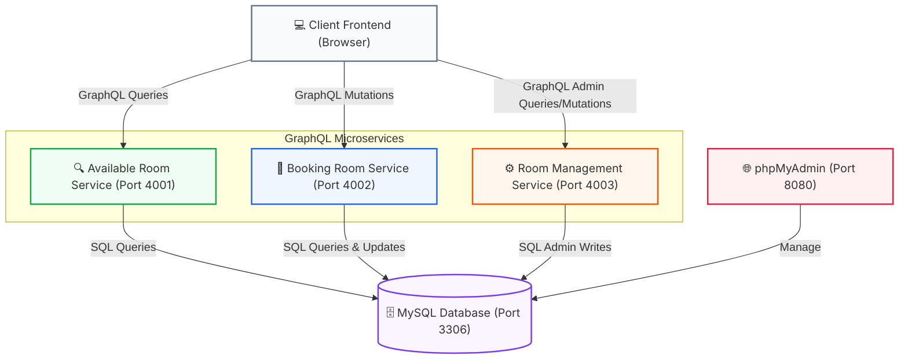
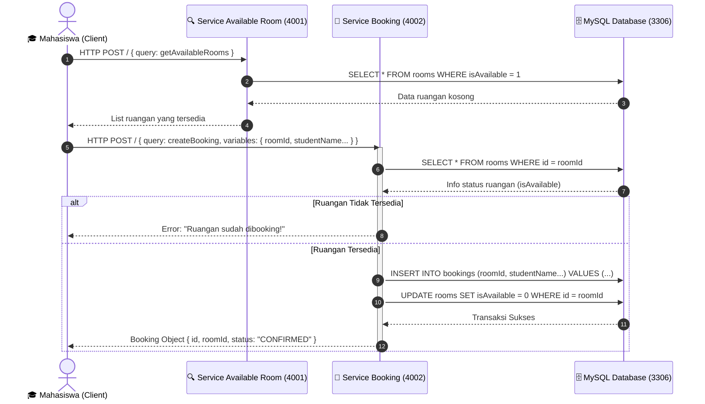

# 🏫 Tel-U Room Hub (Facility Booking System)

[](https://graphql.org/)
[](https://www.apollographql.com/docs/apollo-server/v3/)
[](https://docs.docker.com/compose/)
[](https://www.mysql.com/)

Sistem Informasi Terintegrasi berbasis microservices GraphQL untuk melakukan pencarian, pengelolaan, dan pemesanan ruangan diskusi/lab di lingkungan Universitas Telkom. 

Sistem ini didesain menggunakan **3 Microservices GraphQL** independen dengan Apollo Server, database MySQL terpusat, dan frontend web interaktif (Single Page Application) yang dideploy menggunakan Docker Compose.

---

## 🗺️ Arsitektur Sistem (System Architecture)

Sistem ini menggunakan arsitektur microservices terdistribusi di mana client berkomunikasi langsung ke masing-masing service GraphQL sesuai dengan tanggung jawabnya (Decoupled Services).



---

## ⏱️ Diagram Alur Pemesanan Ruangan (Sequence Diagram)

Diagram di bawah ini menggambarkan alur kerja saat seorang mahasiswa melakukan reservasi ruangan hingga data di basis data terupdate.



---

## 🔌 Detail Port & Layanan (Port Mapping)

| Layanan (Service) | Port Host | Endpoint GraphQL | Deskripsi |
| :--- | :--- | :--- | :--- |
| **View Available Room** | `4001` | `http://localhost:4001/` | Digunakan mahasiswa untuk query daftar ruangan yang berstatus kosong/tersedia. |
| **Booking Room** | `4002` | `http://localhost:4002/` | Digunakan untuk melakukan mutasi pemesanan (booking) & pembatalan (cancel). |
| **Room Management** | `4003` | `http://localhost:4003/` | Digunakan oleh admin untuk mengelola (melihat seluruhnya, menambah, menghapus) inventaris ruangan. |
| **MySQL Database** | `3306` | `localhost:3306` | Database relasional MySQL tempat menyimpan tabel `rooms` dan `bookings`. |
| **phpMyAdmin** | `8080` | `http://localhost:8080/` | Antarmuka berbasis web untuk mengelola database MySQL (Username: `root`, Password: [kosong]). |
| **Client Frontend** | Static file | `client/index.html` | Aplikasi Frontend berbasis Tailwind CSS yang langsung terhubung ke port-port di atas. |

---

## 📂 Struktur Dokumentasi API (Swagger & SQL)

Semua dokumen spesifikasi API interaktif dan basis data disimpan dalam direktori [api-docs/](file:///d:/tubes%20iae/Telu-room-hub-GraphQL-Project/api-docs/):
* **[openapi.yaml](file:///d:/tubes%20iae/Telu-room-hub-GraphQL-Project/api-docs/openapi.yaml)**: File OpenAPI 3.0 YAML yang memetakan query & mutation GraphQL agar dapat diimpor langsung ke Postman, Insomnia, atau Swagger Editor.
* **[swagger-ui.html](file:///d:/tubes%20iae/Telu-room-hub-GraphQL-Project/api-docs/swagger-ui.html)**: Halaman dokumentasi Swagger UI interaktif. **Dapat dibuka offline langsung dengan mengklik dua kali pada file ini** di browsermu (bebas dari masalah CORS!).
* **[schema.sql](file:///d:/tubes%20iae/Telu-room-hub-GraphQL-Project/api-docs/schema.sql)**: Skrip inisialisasi basis data lengkap dengan dummy data siap pakai.

---

## 🚀 Cara Menjalankan Aplikasi (Setup & Installation)

### Metode A: Menggunakan Docker Compose (Sangat Direkomendasikan)
Docker akan otomatis mengunduh package, mengatur container, menginisialisasi MySQL, dan menjalankan seluruh microservices.

1. Buka terminal pada root direktori proyek.
2. Jalankan perintah berikut untuk mem-build dan menjalankan seluruh container:
   ```bash
   docker-compose up --build
   ```
3. Tunggu hingga terminal menampilkan log bahwa semua service telah berjalan.
4. Buka **phpMyAdmin** di [http://localhost:8080](http://localhost:8080).
5. Pilih database `telu_room_hub_eai`. Jika tabel belum terbuat otomatis, impor file [api-docs/schema.sql](file:///d:/tubes%20iae/Telu-room-hub-GraphQL-Project/api-docs/schema.sql) pada menu **Import**.
6. Klik dua kali pada file `client/index.html` untuk membuka frontend di browser Anda.

---

### Metode B: Menjalankan Secara Manual (Tanpa Docker)
Jika Anda tidak menggunakan Docker, pastikan Anda memiliki **MySQL** yang berjalan lokal pada port `3306` tanpa password, dengan database bernama `telu_room_hub_eai`.

1. **Inisialisasi Database**:
   - Buka MySQL client/phpMyAdmin Anda.
   - Buat database `telu_room_hub_eai`.
   - Eksekusi seluruh kueri yang ada di file [api-docs/schema.sql](file:///d:/tubes%20iae/Telu-room-hub-GraphQL-Project/api-docs/schema.sql).

2. **Jalankan Masing-masing Service**:
   Buka 3 terminal baru, lalu jalankan perintah berikut di masing-masing folder service:
   
   * **Terminal 1 (View Available Room):**
     ```bash
     cd services/view-available-room
     npm install
     npm start
     ```
   * **Terminal 2 (Booking Room):**
     ```bash
     cd services/booking-room
     npm install
     npm start
     ```
   * **Terminal 3 (Room Management):**
     ```bash
     cd services/room-management
     npm install
     npm start
     ```

3. **Jalankan Frontend**:
   Buka file [client/index.html](file:///d:/tubes%20iae/Telu-room-hub-GraphQL-Project/client/index.html) di browser Anda.

---

## 📝 Contoh Pemanggilan API (GraphQL Query & Mutation Examples)

Berikut adalah contoh kueri (request) dan hasil kembalian (response) untuk masing-masing microservice. Anda dapat mengirimkannya menggunakan Swagger UI, Postman, ataupun `curl`.

### 1. View Available Rooms Service (Port 4001)

#### Query: `getAvailableRooms`
* **Method:** `POST`
* **URL:** `http://localhost:4001/`
* **Headers:** `Content-Type: application/json`

**Request Body (JSON):**
```json
{
  "query": "query GetAvailableRooms { getAvailableRooms { id name capacity facility isAvailable } }"
}
```

**Response Body (JSON):**
```json
{
  "data": {
    "getAvailableRooms": [
      {
        "id": "KU3.05.01",
        "name": "Integrated Lab Sandbox",
        "capacity": 30,
        "facility": ["Projector", "Whiteboard", "High-Speed Wi-Fi", "AC"],
        "isAvailable": true
      }
    ]
  }
}
```

---

### 2. Booking Room Service (Port 4002)

#### Mutation: `createBooking`
* **Method:** `POST`
* **URL:** `http://localhost:4002/`
* **Headers:** `Content-Type: application/json`

**Request Body (JSON):**
```json
{
  "query": "mutation CreateBooking($roomId: ID!, $studentName: String!, $studentId: String!, $bookingTime: String!) { createBooking(roomId: $roomId, studentName: $studentName, studentId: $studentId, bookingTime: $bookingTime) { id roomId studentName studentId bookingTime status } }",
  "variables": {
    "roomId": "KU3.05.01",
    "studentName": "Azzam Rabbani",
    "studentId": "1202220001",
    "bookingTime": "2026-06-25 10:00:00"
  }
}
```

**Response Body (JSON):**
```json
{
  "data": {
    "createBooking": {
      "id": "1",
      "roomId": "KU3.05.01",
      "studentName": "Azzam Rabbani",
      "studentId": "1202220001",
      "bookingTime": "2026-06-25 10:00:00",
      "status": "CONFIRMED"
    }
  }
}
```

#### Mutation: `cancelBooking`
* **Method:** `POST`
* **URL:** `http://localhost:4002/`
* **Headers:** `Content-Type: application/json`

**Request Body (JSON):**
```json
{
  "query": "mutation CancelBooking($bookingId: ID!) { cancelBooking(bookingId: $bookingId) { id roomId studentName status } }",
  "variables": {
    "bookingId": "1"
  }
}
```

**Response Body (JSON):**
```json
{
  "data": {
    "cancelBooking": {
      "id": "1",
      "roomId": "KU3.05.01",
      "studentName": "Azzam Rabbani",
      "status": "CANCELLED"
    }
  }
}
```

---

### 3. Room Management Service (Port 4003)

#### Mutation: `addRoom`
* **Method:** `POST`
* **URL:** `http://localhost:4003/`
* **Headers:** `Content-Type: application/json`

**Request Body (JSON):**
```json
{
  "query": "mutation AddRoom($id: ID!, $name: String!, $capacity: Int!, $facility: [String!]!) { addRoom(id: $id, name: $name, capacity: $capacity, facility: $facility) { id name capacity facility isAvailable } }",
  "variables": {
    "id": "KU3.05.03",
    "name": "Discussion Room 2B",
    "capacity": 12,
    "facility": ["Projector", "Whiteboard", "High-Speed Wi-Fi", "AC"]
  }
}
```

**Response Body (JSON):**
```json
{
  "data": {
    "addRoom": {
      "id": "KU3.05.03",
      "name": "Discussion Room 2B",
      "capacity": 12,
      "facility": ["Projector", "Whiteboard", "High-Speed Wi-Fi", "AC"],
      "isAvailable": true
    }
  }
}
```

#### Mutation: `deleteRoom`
* **Method:** `POST`
* **URL:** `http://localhost:4003/`
* **Headers:** `Content-Type: application/json`

**Request Body (JSON):**
```json
{
  "query": "mutation DeleteRoom($id: ID!) { deleteRoom(id: $id) }",
  "variables": {
    "id": "KU3.05.03"
  }
}
```

**Response Body (JSON):**
```json
{
  "data": {
    "deleteRoom": "Ruangan dengan ID KU3.05.03 berhasil dihapus."
  }
}
```

---

## 🐳 Contoh Menjalankan Curl
Jika Anda ingin mengetes langsung via CLI/Terminal:
```bash
curl -X POST http://localhost:4001/ \
  -H "Content-Type: application/json" \
  -d '{"query": "query { getAvailableRooms { id name } }"}'
```

---
*Dibuat dengan ❤️ untuk Kelompok Tugas Besar EAI - Telkom University*
