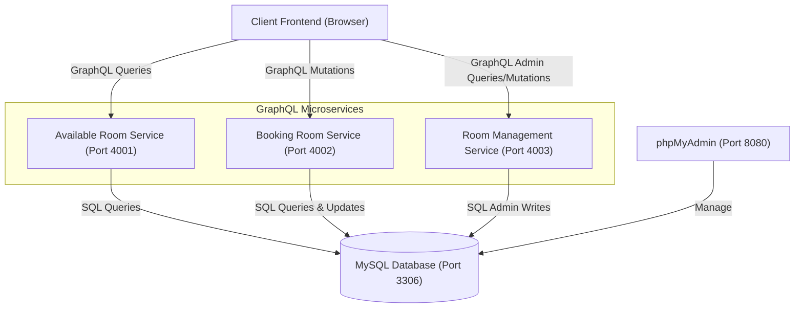

# SYSTEM & API DOCUMENTATION REPORT
## TEL-U ROOM HUB (FACILITY BOOKING SYSTEM)

---

## 1. System Architecture

The **Tel-U Room Hub** is designed using a **decentralized GraphQL Microservices architecture**. It consists of 3 independent backend services (Apollo Server 3) communicating with a single shared MySQL database.

### Architecture Diagram
Below is the system architecture visualization representing the interactions between the Client, GraphQL Microservices, and the Database:



### Role of Each Service:
1. **Available Room Service (Port 4001)**: Serves queries to filter and locate rooms that are currently vacant (available).
2. **Booking Room Service (Port 4002)**: Handles mutations for creating new room reservations and cancelling existing bookings.
3. **Room Management Service (Port 4003)**: Exposes administrative operations to modify the room inventory (list all, add new, and delete rooms).
4. **MySQL Database (Port 3306)**: Serves as the central persistent storage for the `rooms` and `bookings` tables.

---

## 2. ERD & Type Schema

### Entity Relationship Diagram (ERD)
The system contains 2 primary entities: `rooms` and `bookings`, with a **One-to-Many** relationship (one room can have multiple booking transactions over time).

* **rooms.id (PK)** is referenced by **bookings.roomId (FK)**.

#### MySQL Database Table Schemas
1. **Table `rooms`** (Stores room configuration details):
   - `id` (VARCHAR(50), Primary Key) - Unique identifier for the room (e.g. KU3.05.01)
   - `name` (VARCHAR(100)) - Full room name (e.g. Integrated Lab Sandbox)
   - `capacity` (INT) - Maximum seating capacity
   - `facility` (VARCHAR(255)) - Comma-separated list of facilities
   - `isAvailable` (TINYINT(1)) - Current status (1 = Available, 0 = Reserved)

2. **Table `bookings`** (Stores transaction records):
   - `id` (INT, Auto Increment, Primary Key) - Unique reservation ID
   - `roomId` (VARCHAR(50), Foreign Key) - Associated room ID
   - `studentName` (VARCHAR(100)) - Student full name
   - `studentId` (VARCHAR(50)) - Student identification number (NIM)
   - `bookingTime` (DATETIME) - Scheduled time of reservation
   - `status` (VARCHAR(20)) - Status of reservation (CONFIRMED, CANCELLED)

---

### GraphQL Type Schema
The following represents the data models and operations declared in the GraphQL schemas:

#### Object Types:
```graphql
type Room {
  id: ID!
  name: String!
  capacity: Int!
  facility: [String!]!
  isAvailable: Boolean!
}

type Booking {
  id: ID!
  roomId: ID!
  studentName: String!
  studentId: String!
  bookingTime: String!
  status: String!
  room: Room
}
```

#### Query & Mutation Operations:
```graphql
type Query {
  # View Available Room Service
  getAvailableRooms: [Room!]!
  
  # Room Management Service
  getAllRooms: [Room!]!
}

type Mutation {
  # Booking Room Service
  createBooking(roomId: ID!, studentName: String!, studentId: String!, bookingTime: String!): Booking!
  cancelBooking(bookingId: ID!): Booking!

  # Room Management Service
  addRoom(id: ID!, name: String!, capacity: Int!, facility: [String!]!): Room!
  deleteRoom(id: ID!): String!
}
```

---

## 3. API Integration Testing (Queries & Mutations)

API integration tests were performed using the interactive **Swagger UI** (OpenAPI Wrapper).

### Execution Screenshot: getAvailableRooms Query
Below is the execution result showing Swagger UI successfully sending a request to the local available rooms service and receiving a `200 OK` JSON response from the database:


---

## 4. Client Application User Interface

The frontend client is implemented as a responsive Single Page Application (SPA) styled with Tailwind CSS. It communicates directly with the respective port mappings of the GraphQL backend.

### User Interface Screenshot: Student View
Here is the front-facing screen (Student View) showing the room list fetched dynamically from the database:


---

## 5. Installation & Setup Guide

### Prerequisites
1. **Node.js** (Version 16 or higher)
2. **XAMPP** (For local MySQL database server)

### Step-by-Step Setup:

1. **Database Setup in XAMPP**:
   - Launch the **XAMPP Control Panel**.
   - Click **Start** next to the **MySQL** module.
   - Access phpMyAdmin at `http://localhost/phpmyadmin`.
   - Create a new database named **`telu_room_hub_eai`**.
   - Select the database, navigate to the **Import** tab, choose the file **`api-docs/schema.sql`** from your workspace, and click import.

2. **Starting the GraphQL Microservices**:
   Open three separate terminal windows in VS Code and execute the following commands:
   
   * **Terminal 1 (View Available Room Service)**:
     ```bash
     cd services/view-available-room
     npm install
     npm start
     ```
   * **Terminal 2 (Booking Room Service)**:
     ```bash
     cd services/booking-room
     npm install
     npm start
     ```
   * **Terminal 3 (Room Management Service)**:
     ```bash
     cd services/room-management
     npm install
     npm start
     ```

3. **Running the Frontend Client**:
   - Double-click the file **`client/index.html`** in your file manager to open it in a web browser. The client application is now live and interactive!
