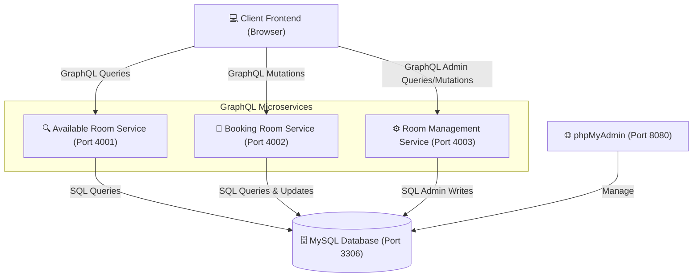
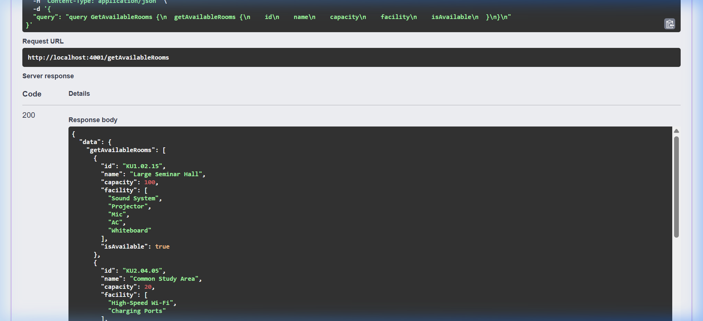
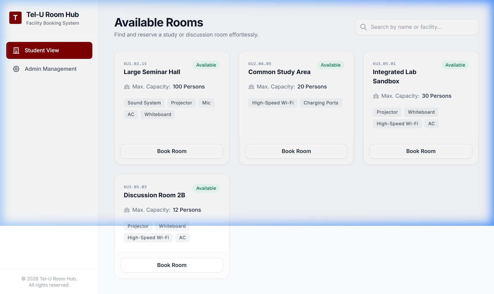

# 🏫 LAPORAN DOKUMENTASI SISTEM & API
## TEL-U ROOM HUB (FACILITY BOOKING SYSTEM)

---

## 1. Arsitektur Sistem (System Architecture)

Sistem **Tel-U Room Hub** dirancang menggunakan arsitektur **GraphQL Microservices terdistribusi**. Terdiri dari 3 backend service independen (Apollo Server 3) yang berkomunikasi ke satu database MySQL yang sama. 

### Diagram Arsitektur
Berikut adalah visualisasi arsitektur sistem yang menggambarkan interaksi antara Client, Microservices GraphQL, dan Database:



### Detail Peran Layanan:
1. **Available Room Service (Port 4001)**: Melayani pencarian dan filter ruangan yang berstatus kosong (tersedia).
2. **Booking Room Service (Port 4002)**: Menangani mutasi pembuatan reservasi ruangan baru serta pembatalan reservasi.
3. **Room Management Service (Port 4003)**: Menyediakan fungsi administratif bagi admin untuk memodifikasi inventaris ruangan (melihat semua, menambah, dan menghapus ruangan).
4. **MySQL Database (Port 3306)**: Penyimpanan data utama untuk tabel `rooms` dan `bookings`.

---

## 2. ERD & Skema Tipe (ERD / Type Schema)

### Entity Relationship Diagram (ERD)
Sistem memiliki 2 entitas utama, yaitu `rooms` (ruangan) dan `bookings` (transaksi pemesanan) dengan relasi **One-to-Many** (satu ruangan dapat memiliki banyak riwayat booking).

* **rooms.id (PK)** berhubungan dengan **bookings.roomId (FK)**.

#### Skema Tabel Database MySQL
1. **Tabel `rooms`** (Menyimpan data ruangan):
   - `id` (VARCHAR(50), Primary Key) - Kode unik ruangan (misal: KU3.05.01)
   - `name` (VARCHAR(100)) - Nama ruangan (misal: Integrated Lab Sandbox)
   - `capacity` (INT) - Kapasitas maksimal orang
   - `facility` (VARCHAR(255)) - Daftar fasilitas dipisahkan koma
   - `isAvailable` (TINYINT(1)) - Ketersediaan (1 = Tersedia, 0 = Dibooking)

2. **Tabel `bookings`** (Menyimpan data reservasi):
   - `id` (INT, Auto Increment, Primary Key) - ID transaksi booking
   - `roomId` (VARCHAR(50), Foreign Key) - Kode ruangan yang dipesan
   - `studentName` (VARCHAR(100)) - Nama lengkap mahasiswa
   - `studentId` (VARCHAR(50)) - NIM mahasiswa
   - `bookingTime` (DATETIME) - Jadwal waktu pemesanan
   - `status` (VARCHAR(20)) - Status reservasi (CONFIRMED, CANCELLED)

---

### Skema GraphQL (Type Schema)
Berikut adalah representasi tipe data pada schema GraphQL untuk masing-masing objek:

#### Object Types:
```graphql
type Room {
  id: ID!
  name: String!
  capacity: Int!
  facility: [String!]!
  isAvailable: Boolean!
}

type Booking {
  id: ID!
  roomId: ID!
  studentName: String!
  studentId: String!
  bookingTime: String!
  status: String!
  room: Room
}
```

#### Query & Mutation Operations:
```graphql
type Query {
  # View Available Room Service
  getAvailableRooms: [Room!]!
  
  # Room Management Service
  getAllRooms: [Room!]!
}

type Mutation {
  # Booking Room Service
  createBooking(roomId: ID!, studentName: String!, studentId: String!, bookingTime: String!): Booking!
  cancelBooking(bookingId: ID!): Booking!

  # Room Management Service
  addRoom(id: ID!, name: String!, capacity: Int!, facility: [String!]!): Room!
  deleteRoom(id: ID!): String!
}
```

---

## 3. Dokumentasi Pengujian API (Queries & Mutations)

Pengujian API dilakukan menggunakan halaman dokumentasi interaktif **Swagger UI** (OpenAPI Wrapper).

### Screenshot Hasil Eksekusi Query getAvailableRooms
Di bawah ini adalah screenshot riil saat kueri dikirimkan ke server melalui antarmuka Swagger dan sukses mengembalikan respon JSON `200` dari basis data:



---

## 4. Tampilan Aplikasi Klien (Client Application)

Aplikasi klien dibuat menggunakan antarmuka Single Page Application (SPA) responsif berbasis Tailwind CSS. Aplikasi terhubung langsung secara real-time ke masing-masing port microservices.

### Screenshot Student View (Daftar Ruangan Tersedia)
Berikut adalah tampilan halaman depan (Student View) yang menampilkan kartu-kartu ruangan kosong yang siap dipesan oleh mahasiswa:



---

## 5. Panduan Instalasi & Menjalankan (Installation Guide)

### Persyaratan Awal (Prerequisites)
1. **Node.js** (Versi 16 atau ke atas)
2. **XAMPP** (Untuk mengaktifkan database MySQL)

### Langkah-Langkah Menjalankan:

1. **Persiapan Database XAMPP**:
   - Buka **XAMPP Control Panel** di komputer Anda.
   - Klik **Start** pada modul **MySQL**.
   - Buka phpMyAdmin di browser Anda (`http://localhost/phpmyadmin`).
   - Buat database baru bernama **`telu_room_hub_eai`**.
   - Klik database tersebut, buka tab **Import**, pilih file **`api-docs/schema.sql`** di folder proyek Anda, lalu jalankan import.

2. **Menjalankan Microservices Backend**:
   Buka terminal di VS Code, lalu jalankan perintah berikut untuk menginstal dependensi dan memulai server:
   
   * **Terminal 1 (View Available Room Service)**:
     ```bash
     cd services/view-available-room
     npm install
     npm start
     ```
   * **Terminal 2 (Booking Room Service)**:
     ```bash
     cd services/booking-room
     npm install
     npm start
     ```
   * **Terminal 3 (Room Management Service)**:
     ```bash
     cd services/room-management
     npm install
     npm start
     ```

3. **Menjalankan Frontend**:
   - Cukup buka file **`client/index.html`** langsung di web browser Chrome atau Edge Anda. Aplikasi sudah siap digunakan secara interaktif!
